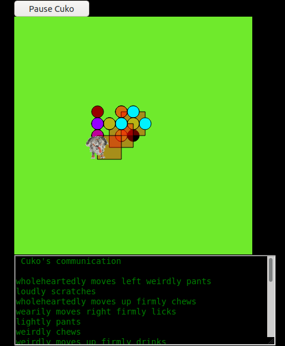

# context-free-grammar
Some code in p5.js prolog and python for context free grammars

Here I am starting to visualize a very simple, Context Free Grammar that describes Cuko's communication.  At this point the verbs are intransitive as Cuko is not interacting with anything yet.  A syntactically correct sentence for Cuko is a Position Phrase and a Verb Phrase, or just a Verb Phrase.  A Position Phrase has is a adverb_mode and a change in position.  A Verb Phrase is an adverb_mode and a verb.  Some examples are Cuko: "loudly moves right abruptly whines" , Cuko: "wearily moves down firmly presents paw" or the simple verb phrase Cuko:"wholeheartedly barks".  I hope to expand the visualization and the grammar rules and even add another dog.  As it stands it this visualization is a sort of narrated random walk. I have also included a short video of my "interviews" with Cuko where I am trying to capture his communication abilities. I even refer to it as speaking. #creativecoding #p5js #contextfreegrammar
