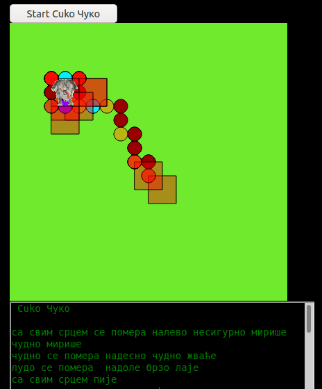

# context-free-grammar
Some code in p5.js prolog and python for context free grammars

[see it live here](https://editor.p5js.org/greggelong/present/PrZAmnnJC)

Here I am starting to visualize a very simple, Context Free Grammar that describes Cuko's communication.  At this point the verbs are intransitive as Cuko is not interacting with anything yet.  A syntactically correct sentence for Cuko is a Position Phrase and a Verb Phrase, or just a Verb Phrase.  A Position Phrase has is a adverb_mode and a change in position.  A Verb Phrase is an adverb_mode and a verb.  Some examples are Cuko: "loudly moves right abruptly whines" , Cuko: "wearily moves down firmly presents paw" or the simple verb phrase Cuko:"wholeheartedly barks".  I hope to expand the visualization and the grammar rules and even add another dog.  As it stands it this visualization is a sort of narrated random walk. I have also included a short video of my "interviews" with Cuko where I am trying to capture his communication abilities. I even refer to it as speaking. #creativecoding #p5js #contextfreegrammar

[link to videos on Instagram](https://www.instagram.com/p/CFVdgxNHkCM/)

[see it live here](https://editor.p5js.org/greggelong/present/haExP3yi4)

Cuko is Serbian! The Grammar makes a few mistakes with Serbian which is much more complicated than English. See last post for more information. This week I have been revisiting Context Free Grammar and text. Perhaps preparing myself for my eventual return to  teaching in Beijing, and being surrounded by yet another language. I used context free grammars in the distant past in Undergraduate with turbo-Prolog. I use it now with Swi Prolog for fun.  In JavaScript and Python it is easy to expand but much harder to parse to a sentence to check. In prolog that's a snap. Context Free grammar expansions are used in L-Systems which I have also been working on this week.#creativecoding #p5js #contextfreegrammar
